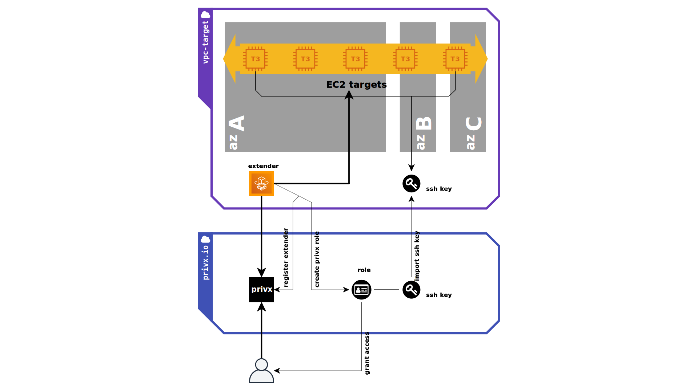

# Elastic Jump Host on AWS

When deploying EC2-based workloads, using an AWS VPC with private subnets is the standard way to achieve the needed security and isolation. Accessing the instances becomes a challenge as the means of entry need be enabled both on the network and credential level - not to forget that the configuration lifecycle needs to also be managed. 

PrivX Extender along with [PrivX SaaS](https://signup.privx.io/leanpam/) implements a Zero Trust, passwordless and keyless access solution for EC2 instances.


## Challenge 

A classic multi-tier architecture is built upon public and private subnets. It is highly recommended to expose the internet-facing access point on the public subnet while keeping all other components in publicly inaccessible private subnet. 

A common deployment model using Amazon Web Services is an Application Load Balancer running in a public subnet whereas instances running the actual application, the database servers and other backend components are placed in a private subnet. How to implement a control plane for this architecture? Even if using Infrastructure as a Code (highly recommended), the reality is that engineering teams still require access to instances to conduct experiments, probe configurations, consult system logs or debug application issues. This is usually done via Secure Shell (SSH) or Remote Desktop (RDP) protocols on Linux and Windows platforms.

Using one-off jump host instances with shared SSH keys, bastions, VPNs or other naïve access gateways increases the deployment complexity, the amount of manual work through having to keep software and credentials up to date so actually they become a security threat. According to a Verizon report, 81% of all breaches are caused by stolen credentials. Teams are struggling to properly manage credentials and prevent credential-related attacks.

Think beyond VPNs, dumb one-off jump hosts or bastion hosts...


## Inspiration

Throughout the years, having observed how permanent passwords and left-behind, forgotten credentials still grant access to critical environments years after they were created and needed, we started the [PrivX SaaS](https://signup.privx.io/leanpam/) projects. We wanted to rid the world of passwords and keys laying on disk, and of standing privileges in general.

[PrivX SaaS](https://signup.privx.io/leanpam/) provides a solution for granting just in time access only for the needed resources, often called Zero Trust access. The solution automates the process of granting and revoking access by integrating with an existing identity management system (it also comes with its own!) and ensures that the users have one click access to right infrastructure resources with correct privileges. It also provides full audit trail and monitoring which is vital if your users are handling sensitive data or if you need to provide access for 3rd parties to your environment. All access to enterprise resources is fully authenticated, fully authorized, and fully encrypted based upon device state and user credentials.

PrivX Extender enables PrivX to reach firewalled private networks or virtual private clouds. Once deployed to a private network, it establishes a number of secure websocket connections to PrivX SaaS for routing traffic from the end users accessing PrivX to the target network. This project will provide IaaC (Infrastructure as a Code) deployment of PrivX Extender to an AWS account.



In addition to deploying PrivX extender, this CDK project will also configure the environment for its use:

* Automatically register the extender to your PrivX SaaS instance;
* Creates a PrivX role to AWS which governs the control plane access to the VPC in question;
* imports requires SSH keys to target AWS account so that target EC2 instances are accessible via PrivX;
* It can also automatically enable access to target nodes via instance tags.

The project utilizes serverless to run the PrivX Extender on the AWS account - everything is managed for you!


## Getting Started

The latest version of Infrastructure as a Code is available at the main branch of this repository. All development, including new features and bug fixes, take place on the master branch using forking and pull requests as described in contribution guidelines. If you find any issue with the project or missing a feature please open an [issue to us](https://github.com/SSHcom/extender-on-aws/issues).


1. Sign Up for [PrivX SaaS](https://signup.privx.io/leanpam/).

2. Obtain [access to target AWS Account](https://docs.aws.amazon.com/cli/latest/userguide/cli-chap-configure.html). You shall have the ability to create/delete AWS resources. Ultimately, you are deploying this solution to your own AWS account.

3. Clone extender-on-aws repository
```bash
git clone https://github.com/SSHcom/extender-on-aws
cd extender-on-aws
```

4. Configure access rights to your AWS account
```bash
export AWS_ACCESS_KEY_ID=Your-Access-Key
export AWS_SECRET_ACCESS_KEY=Your-Secret-Key
export CDK_DEFAULT_ACCOUNT=Your-Account-Id
export CDK_DEFAULT_REGION=eu-west-1
export AWS_DEFAULT_REGION=eu-west-1
```

5. We are using [AWS CDK](https://github.com/aws/aws-cdk) and [TypeScript](https://github.com/microsoft/typescript) to code this Infrastructure as a Code project. You have to configure your development environment with [node and npm](https://nodejs.org/en/download/) version 10.x or later and install required components.
```bash
## with brew on MacOS
brew install node

## then install CDK
npm install -g typescript ts-node aws-cdk
```

6. Install dependencies
```bash
npm install
```

7. Configure and bootstrap target AWS region with AWS CDK. You have to bootstrap a region only once during life time
```bash
cdk bootstrap aws://${CDK_DEFAULT_ACCOUNT}/${CDK_DEFAULT_REGION}
```

8. Obtain access/secret keys from PrivX Instance so that the extender is able to configure an access to your private subnet. 
  - Login as `superuser`
  - Go to: Settings > Deployment > Integrate with PrivX Using API clients
  - Create new API client (or use existing one)
  - Give a client permissions: `api-clients-manage`, `roles-view`, `roles-manage`
  - Deployment process requires: `OAuth Client Secret`, `API Client ID` and `API Client Secret` values. 

9. Use AWS CDK command line tools to deploy PrivX extender to your AWS Account
```bash
cdk deploy extender-yourname \
  -c name=yourname \
  -c vpc=vpc-00000000000000000 \
  -c api=https://example.privx.io \
  -c client-id=your-api-client-id \
  -c client-secret=your-api-client-secret \
  -c oauth2-secret=your-oauth-secret

## Note the deployment requires:
##    name           Unique name of the extender. It MUST contain only latin letters 
##                   and digits. This name is used to create a role and name ssh key pair.
##
##    vpc            Unique identity of existing VPC, extender is deployed to this VPC.
##
##    api            HTTPS address to PrivX API (e.g. https://example.privx.io)
##
##    client-id      Your API-Client-ID, see previous stage
##
##    client-secret  Your API-Client-Secret, see previous stage
##
##    oauth2-secret  Your OAuth-Client-Secret, see previous stage
##
```

10. In a few minutes, your own instance of PrivX Extender is available. Login to PrivX to observe its status.


## Next Steps

Usage of [AWS Host Directory](https://help.ssh.com/support/solutions/articles/36000194728-getting-started-with-privx#privx-gettingstarted-hostdirectories) is an easiest way to on-board hosts from your AWS account. Please note, this stack creates AWS User `extender-yourname-hostscan` with only `ec2:Describe*` permission. Use it for the directory definition. 

As a post install stage, you can validate functionality of PrivX Extender with example SSH targets. Use this example to automate your IaC delivery.

```bash
cdk example/ec2-ssh-targets
npm install

cdk deploy ec2-ssh-targets \
  -c name=yourname \
  -c vpc=vpc-00000000000000000
```

## Bugs

If you experience any issues with the library, please let us know via [GitHub issues](https://github.com/SSHcom/extender-on-aws/issues). We appreciate detailed and accurate reports that help us to identify and replicate the issue.

* **Specify** the configuration of your environment. Include which operating system you use and the versions of runtime environments.

* **Attach** logs, screenshots and exceptions, if possible.

* **Reveal** the steps you took to reproduce the problem, include code snippet or links to your project.


## How To Contribute

The project is [MIT](LICENSE) licensed and accepts contributions via GitHub pull requests:

1. Fork it
2. Create your feature branch (`git checkout -b my-new-feature`)
3. Commit your changes (`git commit -am 'Added some feature'`)
4. Push to the branch (`git push origin my-new-feature`)
5. Create new Pull Request

The development requires TypeScript and AWS CDK

```bash
npm install -g typescript ts-node aws-cdk
```

```bash
git clone https://github.com/SSHcom/extender-on-aws
cd privx-on-aws

npm install
npm run build
npm run test
npm run lint
```

## References

1. [Passwords Are Still a Problem According to the 2019 Verizon Data Breach Investigations Report](http://blog.lastpass.com/2019/05/passwords-still-problem-according-2019-verizon-data-breach-investigations-report/)

## License

[](LICENSE)
